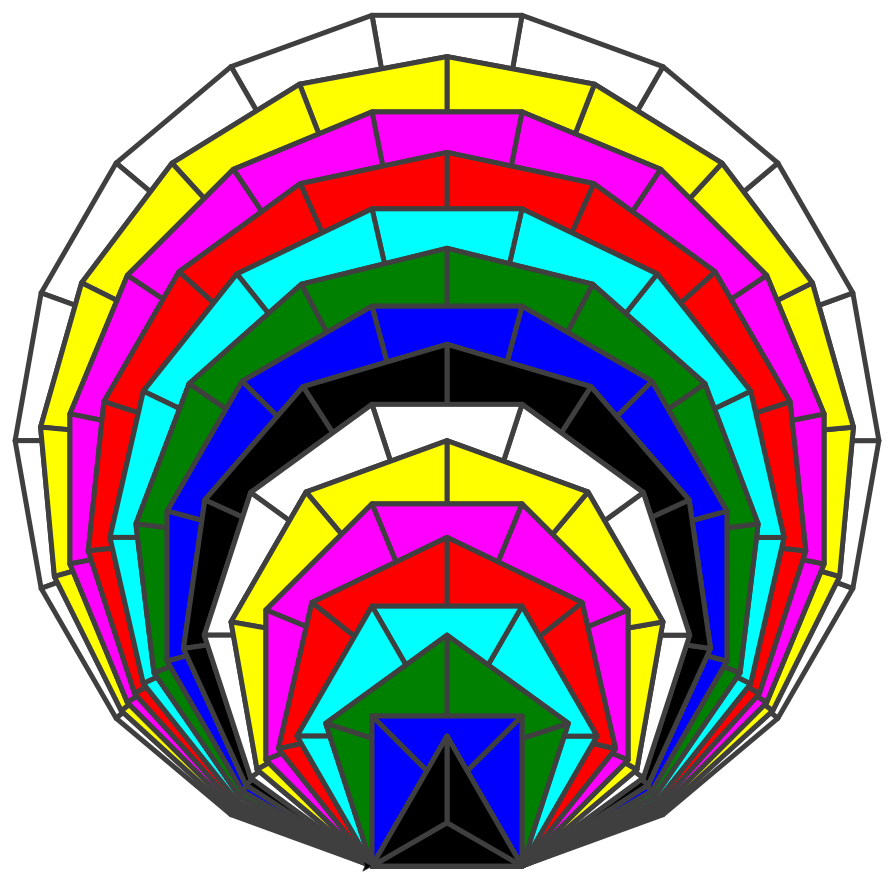

# Welcome to the Adnanian Order (CURRENTLY UNDERGOING UPDATES & MAJOR REVISIONS)

## 👋 Hi! My Name is Adnan Wazwaz!

I'm a an indie full-stack app developer, former deployment technician, and entrepreneur.

🔭 I completed a System Design course on Udemy in January 2026.

⚡ I'm also very passionate about the Arabic language (specifically Fusha or Classical/Modern Standard). I love learning other languages too.

📫 You can reach out to me on LinkedIn by clicking the button below:

## 🖥️ My Tech Stack

Icons are taken from **[devicons](https://devicons.railway.app/)** and **[TechIcons](https://techicons.dev/?search=j)**.

Note: portfolio website is temproarily suspended, until further notice. :)
Note 5/28: portfolio may be revised to include all entrepreneurial side projects in more detail, and not just coding projects.

<table>
  <tr>
    <td align="center" width="72"></td>
    <td align="center" width="72"></td>
    <td align="center" width="72"></td>
    <td align="center" width="72"></td>
    <td align="center" width="72"></td>
    <td align="center" width="72"></td>
    <td align="center" width="72"></td>
    <td align="center" width="72"></td>
  </tr>
  <tr>
    <td align="center" width="72"></td>
    <td align="center" width="72"></td>
    <td align="center" width="72"></td>
    <td align="center" width="72"></td>
    <td align="center" width="72"></td>
    <td align="center" width="72"></td>
    <td align="center" width="72"></td>
    <td align="center" width="72"></td>
  </tr>
  <tr>
    <td align="center" width="72"></td>
    <td align="center" width="72"></td>
    <td align="center" width="72"></td>
    <td align="center" width="72"></td>
    <td align="center" width="72"></td>
    <td align="center" width="72"></td>
    <td align="center" width="72"></td>
    <td align="center" width="72"></td>
  </tr>
</table>
